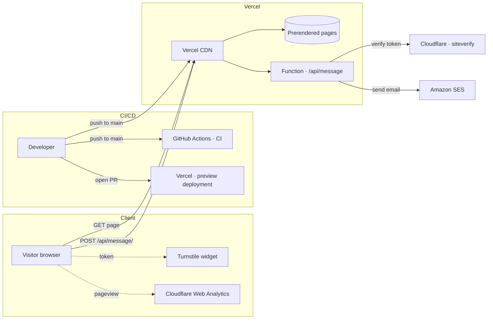

[](https://github.com/parammehta/portfolio/actions/workflows/ci.yml)

# Param Mehta — Portfolio

[](https://parammehta.com)

My personal portfolio site. Built with [Next.js](https://nextjs.org/), [Three.js](https://threejs.org/), and [Framer Motion](https://www.framer.com/motion/). View the [live site](https://parammehta.com).

## Architecture

One set of infrastructure, three flows across it: a visitor loading a page, a visitor submitting the contact form, and a commit shipping itself to production. There's a full write-up in [Anatomy of this site](https://parammehta.com/articles/anatomy-of-this-site).



Solid arrows are request/deploy paths; dashed arrows are client-side side channels. Vercel builds and
ships every push to `main` on its own, and gives every pull request a preview deployment at its own URL.
The contact form is no longer a separately deployed service — it is a route in this repo that ships with
the rest of the site. AWS still sends the mail, via SES, but hosts nothing.

## Install & run

Make sure you have Node.js `24.12.0` installed (see `.nvmrc` — run `nvm use` if you use nvm). Install dependencies with:

```bash
npm install
```

Once it's done, copy `.env.example` to `.env` and fill in the values (see `docs/architecture.md` for details on each variable), then start up a local server with:

```bash
npm run dev
```

Shared UI components (Button, Text, Image, Model, Carousel, ThemeProvider, etc.) live in a
separate package, [refract-ui](https://github.com/parammehta/refract-ui) — its Storybook is at
[storybook.parammehta.com](https://storybook.parammehta.com). This repo only holds
site-specific components (Navbar, Footer, Meta, Page, ...).

To create a production build:

```bash
npm run build
```

To serve that build locally, the same way Vercel runs it:

```bash
npm start
```

## Deployment

The site is hosted on [Vercel](https://vercel.com), which builds and deploys every push to `main`
automatically — there is no deploy command to run. Every pull request also gets its own preview
deployment, so a change is reachable at a real URL before it is merged.

Security headers are declared in `vercel.json` rather than configured in a hosting console, so the
headers the site serves are reviewable in the repo.

The contact form (`src/pages/api/message.api.ts`) runs as a Vercel function and needs these
server-side environment variables set on the project:

| Variable | Purpose |
| --- | --- |
| `PORTFOLIO_AWS_ACCESS_KEY_ID` | IAM user with `ses:SendEmail` only |
| `PORTFOLIO_AWS_SECRET_ACCESS_KEY` | — |
| `PORTFOLIO_AWS_REGION` | SES region, defaults to `us-east-1` |
| `CLOUDFLARE_TURNSTILE_SECRET` | Turnstile server key; unset means unenforced |

The endpoint requires the two credential variables and fails loudly without them — it deliberately
does not fall back to the AWS SDK's default credential chain, which would otherwise pick up a
developer's `~/.aws/credentials` and send real mail from a local dev server.

## Notes

- The rotating background sphere on the homepage is a Three.js shader; its color comes from the fragment shader in `src/pages/home/heroSphere.frag.glsl`.
- The contact form posts to `/api/message/`, handled by `src/pages/api/message.api.ts`. The trailing
  slash matters: `trailingSlash: true` applies to API routes too, so the slashless URL answers with a 308.
