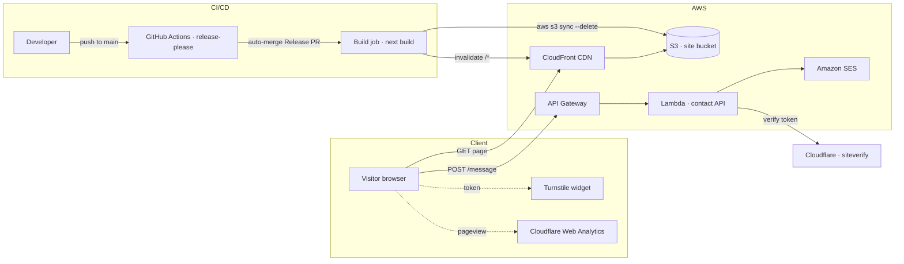

[](https://github.com/parammehta/portfolio/actions/workflows/deploy.yml)

# Param Mehta — Portfolio

[](https://parammehta.com)

My personal portfolio site. Built with [Next.js](https://nextjs.org/), [Three.js](https://threejs.org/), and [Framer Motion](https://www.framer.com/motion/). View the [live site](https://parammehta.com).

## Architecture

One set of infrastructure, three flows across it: a visitor loading a page, a visitor submitting the contact form, and a commit shipping itself to production. There's a full write-up in [Anatomy of this site](https://parammehta.com/articles/anatomy-of-this-site).



Solid arrows are request/deploy paths; dashed arrows are client-side side channels. The site (S3 + CloudFront) ships automatically on release; the contact-form Lambda is deployed separately (`npm run deploy:functions`).

## Install & run

Make sure you have Node.js `24.12.0` installed (see `.nvmrc` — run `nvm use` if you use nvm). Install dependencies with:

```bash
npm install
```

Once it's done, copy `.env.example` to `.env` and fill in the values (see `docs/architecture.md` for details on each variable), then start up a local server with:

```bash
npm run dev
```

Shared UI components (Button, Text, Image, Model, Carousel, ThemeProvider, etc.) live in a
separate package, [refract-ui](https://github.com/parammehta/refract-ui) — its Storybook is at
[storybook.parammehta.com](https://storybook.parammehta.com). This repo only holds
site-specific components (Navbar, Footer, Meta, Page, ...).

To create a production build (static export):

```bash
npm run build
```

To preview that build locally — it's a static export, so this serves the generated files rather than running a Next.js server:

```bash
npm start
```

## Deployment

The site is hosted on AWS (S3 for the static site, Lambda for the contact form). You'll need an AWS account and the AWS CLI installed, and the S3 bucket name in `package.json`'s `deploy` script updated to your own.

Deploy the site to S3:

```bash
npm run deploy
```

Deploy the serverless contact form function (requires `CLOUDFLARE_TURNSTILE_SECRET` env var):

```bash
cd functions
CLOUDFLARE_TURNSTILE_SECRET=<your-secret> npm run deploy
```

## Notes

- The rotating background sphere on the homepage is a Three.js shader; its color comes from the fragment shader in `src/pages/home/heroSphere.frag.glsl`.
- The contact form is wired up to an AWS Lambda function in `functions/`; see `functions/serverless.yml` for its configuration.
